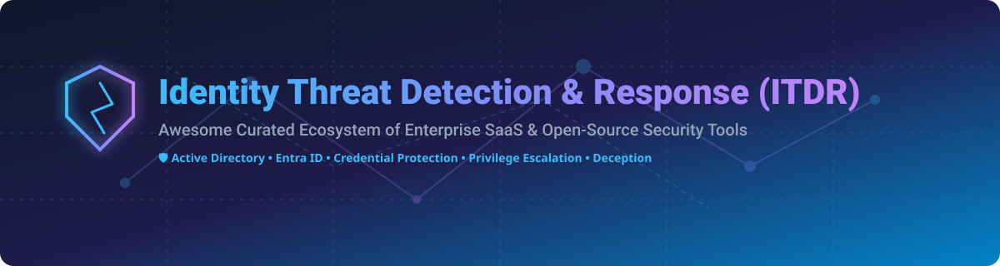

# Awesome-Identity-Threat-Detection-And-Response-ITDR 🛡️

    

## 🌐 Top Identity Threat Detection and Response (ITDR) Platforms Ecosystem

**Curated List of SaaS Products & Open-Source GitHub Projects** 🔍

*Focused on Active Directory & Entra ID Security, Attack Detection, Credential Abuse Prevention, Privilege Escalation Visibility, Deception & Identity Resilience* 🔑

**Last updated: October 2026** 📅

---

### 💡 Overview & Key Features

This repository tracks notable **SaaS platforms** and **open-source projects** for **Identity Threat Detection and Response (ITDR)**. These solutions detect, prevent, and respond to identity-based security threats targeting modern identity infrastructure—especially Microsoft Active Directory, Entra ID (Azure AD), and identity authentication protocols—covering reconnaissance, credential theft, privilege escalation, lateral movement, and identity persistence.

- 🏢 **Enterprise SaaS Solutions**: Microsoft Defender for Identity, CrowdStrike Falcon Identity Protection, Silverfort, Tenable Identity Exposure, SentinelOne Singularity Identity, Semperis, Quest Software, Illusive Networks, Netwrix, and Attivo Networks.
- 🔓 **Open-Source Tooling**: Production-grade tools for attack-path analysis, AD posture evaluation, and detection engineering—especially **BloodHound**, **PingCastle**, **Impacket**, **Responder**, **Velociraptor**, and **Sigma**.

Contributions are welcome! Please feel free to open a Pull Request to add or update entries. 🤝

---

## 📑 Table of Contents

- [☁️ SaaS/Hosted Platforms](#%EF%B8%8F-saashosted-platforms)
- [⚡ Open-Source GitHub Projects](#-open-source-github-projects)
- [🤝 How to Contribute](#-how-to-contribute)
- [☕ Support & Sponsorship](#-support--sponsorship)
- [📈 Star History](#-star-history)
- [⚠️ Disclaimer](#%EF%B8%8F-disclaimer)

---

## ☁️ SaaS/Hosted Platforms

> 📊 **Market Overview:** The global Identity Threat Detection and Response (ITDR) market size is estimated at approximately **$12.5 Billion** (as part of the broader Identity Security market projected to reach over $30B by 2030). The sector is **moderately fragmented**, with platform giants (Microsoft, CrowdStrike, SentinelOne) rapidly acquiring point solutions (e.g., Attivo Networks, Illusive Networks) alongside specialized category leaders (Silverfort, Semperis).

| Product | Description | Valuation / Revenue | Specific Pricing | Free Tier / Trial Limit |
| :--- | :--- | :--- | :--- | :--- |
| **[Microsoft Defender for Identity](https://www.microsoft.com/en-us/security/business/siem-and-xdr/microsoft-defender-identity)** 🛡️ | Microsoft’s ITDR solution that deploys sensors on domain controllers to detect identity attacks and feeds signals into Microsoft Defender XDR. | **$3.1 Trillion** Market Cap ($4.81B Defender/Security Suite ARR) | **$5.50 - $6.60** per user/month standalone (or included in M365 E5 / EMS E5) | **30-day free trial** available via Microsoft 365 E5 Evaluation |
| **[CrowdStrike Falcon Identity Protection](https://www.crowdstrike.com/products/identity-protection/)** 🦅 | Identity threat detection and protection tightly integrated with the Falcon platform, correlating identity events with endpoint telemetry. | **$277.5 Billion** Market Cap ($4.81B FY26 Revenue) | **$15.00** per active identity/year add-on (Falcon Go core from $59.99/device/year) | **15-day free trial** of Falcon platform with identity protection POC |
| **[Illusive Networks](https://illusive.com/)** 🎭 | Identity deception and attack-surface reduction platform (acquired by Proofpoint / Thoma Bravo portfolio). | **$12.3 Billion** Parent Valuation ($1.5B Annual Revenue) | **$35.00** per endpoint/year starting tier for enterprise deception suite | **14-day proof-of-concept (POC)** environment trial upon sales request |
| **[SentinelOne Singularity Identity](https://www.sentinelone.com/platform/singularity-identity/)** 👁️ | Identity threat detection and deception capabilities (incorporates Attivo Networks technology) integrated with Singularity XDR. | **$8.72 Billion** Market Cap ($1.00B FY26 Revenue) | **$229.99** per endpoint/year (included in Singularity Commercial tier) | **30-day managed proof-of-concept (POC)** trial via enterprise sales |
| **[Tenable Identity Exposure](https://www.tenable.com/products/tenable-identity-exposure)** 🎯 | Continuous identity risk assessment and exposure management focused on Active Directory and hybrid identity environments. | **$4.05 Billion** Market Cap ($1.05B TTM Revenue) | **$12.00** per active directory identity/year (min 1,000 identities) | **30-day free trial** of Tenable Exposure Platform |
| **[Silverfort](https://www.silverfort.com/)** 🔒 | Unified identity protection platform providing inline MFA and protection for legacy protocols (Kerberos, NTLM, LDAP) and service accounts. | **$1.0 Billion** Valuation ($139M Estimated Revenue) | **$4.00** per user/month enterprise starting tier | **14-day guided proof-of-concept (POC)** trial for Active Directory |
| **[Semperis](https://www.semperis.com/)** 🌲 | Specialist platform for Active Directory threat detection, prevention, and automated forest recovery / resilience. | **$1.0 Billion** Valuation ($100M+ ARR) | **$3.50** per user/month enterprise starting tier | **30-day trial** for Directory Services Protector (DSP); free Purple Knight assessment tool |
| **[Quest Software](https://www.quest.com/)** 🗝️ | Suite of Active Directory management, auditing, recovery, and security tools (OnDemand Audit / Change Auditor) used for identity hygiene. | **$1.0 Billion** Estimated Revenue (Clearlake Capital PE) | **$3.00** per user/year starting tier for OnDemand Audit & Defense | **30-day full-featured free trial** for OnDemand / Change Auditor tools |
| **[Netwrix](https://www.netwrix.com/)** 📊 | Identity and access auditing, change monitoring, and threat detection (Netwrix 1Secure / Auditor) for Active Directory. | **$739 Million** Funding ($250M+ Estimated Revenue) | **$60.00** per enabled user/year for 1Secure identity protection suite | **20-day full-featured free trial**, reverts to unlimited restricted Community Edition |
| **[Attivo Networks](https://www.attivo.com/)** 🕸️ | Identity deception and lateral-movement detection technology (now fully integrated into SentinelOne Singularity Identity). | *Acquired by SentinelOne* ($617M Deal Value) | Included in SentinelOne Singularity Identity suite licensing | **30-day managed proof-of-concept (POC)** via SentinelOne |

---

## ⚡ Open-Source GitHub Projects

Below is a curated collection of production-grade open-source tools, detection rule repositories, and assessment frameworks for identity security.

| Project Name | Description | Stars |
| :--- | :--- | :--- |
| **[PowerSploit](https://github.com/PowerShellMafia/PowerSploit)** ⚡ | Collection of Microsoft PowerShell modules for post-exploitation and Active Directory identity privilege testing. |  |
| **[Impacket](https://github.com/fortra/impacket)** 🐍 | Collection of Python classes for working with network protocols (Kerberos, NTLM, LDAP) essential for ITDR testing. |  |
| **[Sigma](https://github.com/SigmaHQ/sigma)** 📜 | Generic detection signature format containing extensive identity attack detection rules (Kerberoasting, Golden Ticket, DCSync). |  |
| **[Responder](https://github.com/lgandx/Responder)** 📡 | LLMNR, NBT-NS and MDNS poisoner used for detecting unauthenticated identity credential exposure and relay attacks. |  |
| **[Velociraptor](https://github.com/Velocidex/velociraptor)** 🦖 | Endpoint visibility and digital forensics platform used for enterprise identity incident response and threat hunting. |  |
| **[PrivescCheck](https://github.com/itm4n/PrivescCheck)** 🔎 | PowerShell script that enumerates local identity misconfigurations, privilege escalation vectors, and security posture. |  |
| **[BloodHound](https://github.com/SpecterOps/BloodHound)** 🐕 | Industry-standard tool for mapping Active Directory and Entra ID attack paths and privilege relationships. |  |
| **[PingCastle](https://github.com/netwrix/pingcastle)** 🏰 | Active Directory security assessment tool evaluating identity risk levels and delegation vulnerabilities. |  |
| **[Elastic Detection Rules](https://github.com/elastic/detection-rules)** 🎯 | Open-source detection rules targeting identity attacks, Active Directory abuse, and Entra ID anomalous activity. |  |
| **[BloodHound.py](https://github.com/fox-it/bloodhound.py)** 🦊 | Python-based Active Directory ingestor for BloodHound compatible with Linux/macOS environments. |  |
| **[Canarytokens](https://github.com/thinkst/canarytokens)** 🐤 | Deploy decoy credentials, AWS keys, and honeytokens for early detection of identity reconnaissance. |  |
| **[SharpHound](https://github.com/SpecterOps/SharpHound)** 🗡️ | C# data collector for BloodHound that enumerates AD objects, sessions, and ACLs. |  |
| **[ADRecon](https://github.com/adrecon/ADRecon)** 📋 | Active Directory gathering tool generating comprehensive reports on identity domain state and ACLs. |  |
| **[ImproHound](https://github.com/improsec/ImproHound)** 🐕‍🦺 | Analyzes BloodHound graph data to identify attack paths violating Active Directory tiering models. |  |

---

### 💡 Open-Source ITDR Best Practices

- 📈 Running **BloodHound** (and SharpHound/BloodHound.py collectors) on a regular cadence to surface attack paths and misconfigurations.
- 🛡️ Deploying **PingCastle** and **ADRecon** for automated Active Directory health and posture auditing.
- 🔔 Combining AD enumeration tools with SIEM detection rules (**Sigma**, **Elastic Detection Rules**) for continuous monitoring.
- 🔬 Using **Velociraptor** or **PrivescCheck** for targeted identity incident response and privilege audit.
- 🎯 Deploying honeytokens via **Canarytokens** to detect unauthorized credential access in real time.

---

## 🤝 How to Contribute

Contributions are what make the open-source community an amazing place to learn, inspire, and create! 🌟

1. Fork the Project. 🍴
2. Create your Feature Branch (`git checkout -b feature/AmazingITDRTool`).
3. Commit your Changes (`git commit -m 'Add some AmazingITDRTool'`).
4. Push to the Branch (`git push origin feature/AmazingITDRTool`).
5. Open a Pull Request. 📥

Please ensure links are accurate, descriptions are factual, and pricing details follow the table format!

---

## ☕ Support & Sponsorship

If you found this curated ITDR ecosystem list helpful, please consider starring ⭐ the repository, sharing it with fellow security professionals, or sponsoring the project! Your support keeps this project up-to-date and continuously maintained.

---

## 📈 Star History

---

## ⚠️ Disclaimer

- This is a **community-curated** list — not exhaustive and not an official endorsement.
- Identity threat detection tools interact directly with critical authentication infrastructure. Open-source collectors can generate log noise or require careful scoping in production environments. This list does not constitute formal operational or security advice.

---

**Made with ❤️ for identity security teams, blue teams, and open security tooling advocates.**
